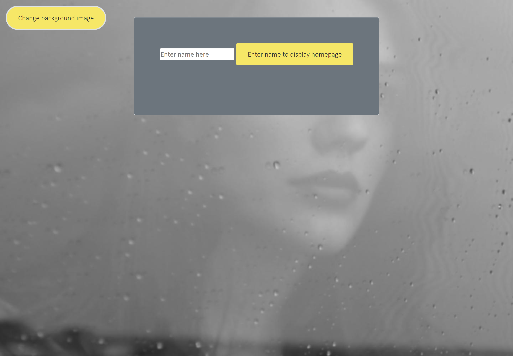
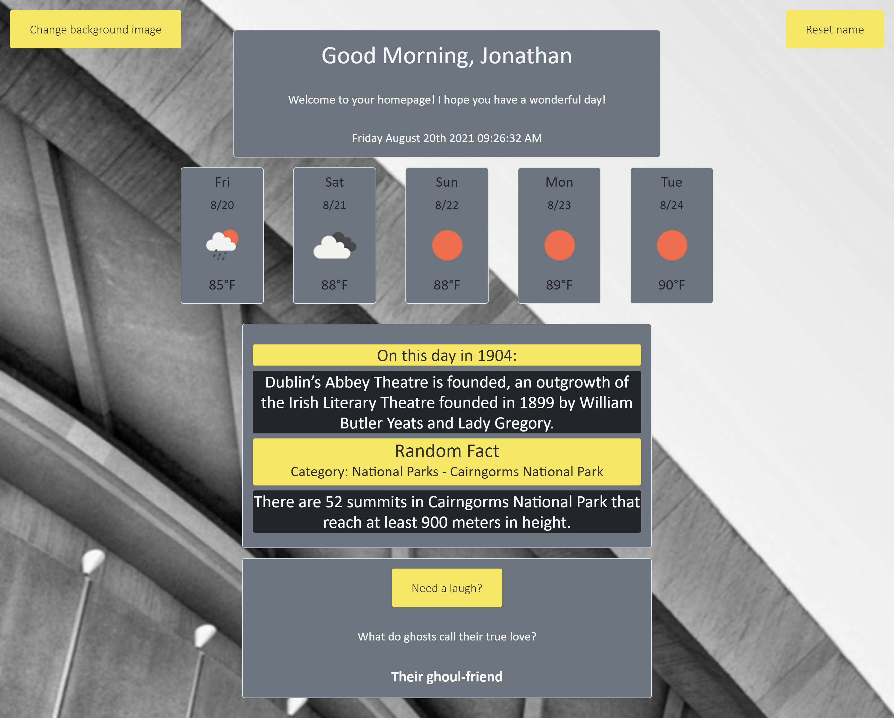

# Project 1: Interactive Front-End Application - New Tab Homepage

## Purpose

The purpose of this project was to create a website that could be utilized for new tabs within the user browser. When first visiting the site the user is prompted to enter in their name, once they do this once the site will greet them whenever they visit it again. The user is presented with the time of day, an optional weather forecast, and some interresting facts/jokes.

Some features of the site are:
- Interactive UI created with HTML, CSS, and JavaScript. Bootstrap was used as the framework for the CSS and JQuery was utilized for website functionality. 
- User has the ability to input their name, which is then saved locally for whenever they open new tabs. This can be reset if they choose. 
- Adaptive greeting using Moment.js that will change depending on the time of day. 
- Randomly generated background that the user can change if they desire. 
- Optional 5-day weather forecast that is taken from the browser location.
- Events that happened on the current day in histroy.
- A random fact and its category.
- User can opt to be presented with a random joke and then cycle through more. 

The site can be found at: https://jpolmon.github.io/Project01/

---
## API's integrated

- Official Joke API: https://official-joke-api.appspot.com
- Fun Generators Fact API: https://fungenerators.com/api/facts/
- OpenWeather One Call API: https://openweathermap.org/api/one-call-api
- Lorem Picsum: https://picsum.photos/

---
## Appearance

### Here is an example of the site upon first visit:

### Here is an example of the site with all interactable content displayed:  

---
## Credits

This site was created by Jonathan Olmon, Eric Duwe, James Hoofard, and Gulshun Eswani with the assistance/guidance of Dane Edwards and Andrew Layendecker. 